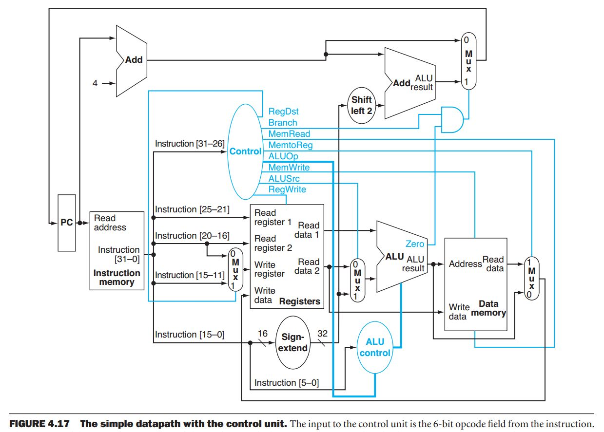
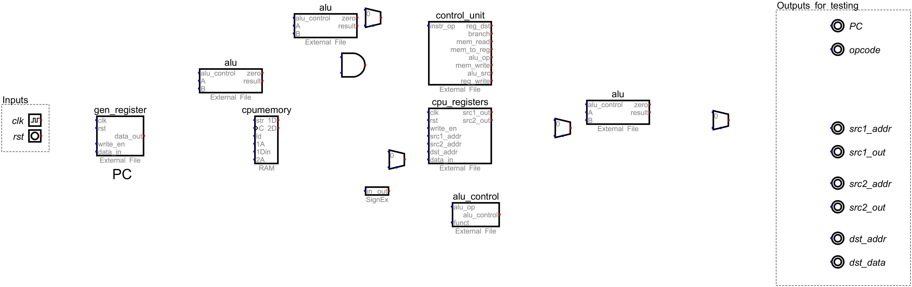

# Lab 4 - Single Cycle Datapath 

## Introduction

In this lab, you will be building a single cycle version of the MIPS datapath. The datapath is composed of many components interconnected. They include an ALU, Registers, Memory, and most importantly the Program Counter (PC). The program counter is the only clocked component within this design and specifies the memory address of the current instruction. Every cycle the PC will be moved to the location of the next instruction. The MIPS architecture is BYTE ADDRESSABLE. Remember this when handling the PC, and the memory (which is WORD ADDRESSABLE).

You will build this datapath (diagramed below in fig. 4-17) in Digital using the template provided ([lab04.dig](./lab04.dig)). If you open this file in Digital
you will notice all the components of the datapath, but without any interonnections using wires. Your goal is to add the necessary
wires in Digital, and test that the datapath is working properly.



To test that it is working properly, we will need to inspect certain elements of the datapath. We will do this in Digital, as well
as in the synthesized testbench using the outputs on the right of the Digital diagram. Below is a table of these output names and their description so that you can wire them up properly.

|Digital Output| Description                                                                                                       |
|--------------|-------------------------------------------------------------------------------------------------------------------|
|`PC`          | This is the value currently stored in the Program Counter register. It is the address of the current instruction. |
|`opcode`      | This is the opcode of the currently executing instruction. It is bits 31 to 26 of the instruction.                |
|`src1_addr`   | This is the register address of the first source register from the instruction.                                   |
|`src1_out`    | This is the data at the register address for `src1_addr` coming from the register file                            |
|`src2_addr`   | This is the register address of the second source register from the instruction.                                  |
|`src2_out`    | This is the data at the register address for `src2_addr` coming from the register file                            |
|`dst_addr`    | This is the register address of the destination register from the instruction.                                    |
|`dst_data`    | This is the data to be stored in register address for `dst_addr` going into the register file                     |


## Assembling & Tracing Instructions

For this lab we will store several instructions in RAM and the datapath will "execute" them. In order to understand if your
implementation is working, we will need to understand two separate concepts: hand assembling instructions and hand tracing a simple 
program. The following sections describe how to do these two concepts briefly.

### Hand Assembling Instrucitons

The following code exercises all the instructions that our simple single cycle datapath can execute. However, what you see below
is human readable, not computer readable. Since computers only understand 1's and 0's, we need to convert this human readable 
assembly into computer readable binary format (this is usually the job of an assembler, but we can do it too). Using this document from [Wikibooks](https://en.wikibooks.org/wiki/MIPS_Assembly/Instruction_Formats), we have all the information we need to assemble these instructions. All the instructions below are either R-type or I-Type instructions. There are no J-Type instructions, so don't
worry about those.

**`init.asm`**
```asm
lw $v0 31($zero)
add $v1 $v0 $v0
sw $v1 132($zero)
sub $a0 $v1 $v0
addi $a1 $v1 12
and $a2 $a1 $v1
or $a3 $a2 $v0
nor $t0 $a2 $v0
slt $a2 $a1 $a0
beq $a2 $zero -8($zero)
lw $t0 132($zero)
```
As an example, let's see how the first instruction would be encoded using the document above. First we know that this instruction
is `lw`. From the last section of the above document, we can use the _Opcodes_ table to learn that the `lw` instruction uses the 
I-type instruction format, and has the opcode 0x23. 

Looking at the I-format instruction from this document we know it's format is:

|opcode  | rs     | rt     | IMM     |
|--------|--------|--------|---------|
| 6 bits | 5 bits | 5 bits | 16 bits |

Where `rs` is the source register (which holds the base addr) and `rt` is the target or destination register. Looking at the first 
instruction we know the destination (the first register from the left) is `$v0` and the source register is `$zero`. Once again, these
are human readable names, and we need computer readable names. Luckily this document has the mapping between the human readable and
computer readable addresses. From this document we learn that `$v0` is register `r2`, which has register address `2`. Next we see that `$zero` is register `r0` which has register address `0`. With this knowledge and a programming calculator to convert 31 to 
binary we can now fully encode this instruction as:

|opcode   | rs    | rt     | IMM              |
|---------|-------|--------|------------------|
| 10 0011 | 00000 | 00010  | 0000000000011111 |
| 0x23    | 0x00  | 0x02   | 0x001F           |

Now putting this all together in both computer readable, and slightly more human readable forms (Hex), we get the following for 
this one instruction:

|                                                      |
|------------------------------------------------------|
| 1000 1100 0000 0010 0000 0000 0001 1111 = 0x8C02001F |

You will need to do assemble the remaining instructions for the lab report, so make sure you understand how to do this procedure.

### Hand Tracing a Simple Program

In order to test your implementation, it is important to know what effects each instruction have on the state of the processor. In this section
we'll learn how to hand trace the execution of instructions and keep track of the changes to state. Specifically, we will keep track of what 
values change in the register file and in RAM. 

To keep track of the state of the register file (the values of the general purpose registers), we can create a table with the name and register
address of each register along with its current value. Below is a table that we can use for this purpose. We will assume that all registers
are initialized to zero.

|Reg. Name|Reg. Addr.|Value |
|---------|---------:|------|
| `$zero` | 0        | 0    |
| `$at`   | 1        | 0    |
| `$v0`   | 2        | 0    |
| `$v1`   | 3        | 0    |
| `$a0`   | 4        | 0    |
| `$a1`   | 5        | 0    |
| `$a2`   | 6        | 0    |
| `$a3`   | 7        | 0    |
| `$t0`   | 8        | 0    |
| `$t1`   | 9        | 0    |
| `$t2`   | 10       | 0    |
| `$t3`   | 11       | 0    |
| `$t4`   | 12       | 0    |
| `$t5`   | 13       | 0    |
| `$t6`   | 14       | 0    |
| `$t7`   | 15       | 0    |
| `$s0`   | 16       | 0    |
| `$s1`   | 17       | 0    |
| `$s2`   | 18       | 0    |
| `$s3`   | 19       | 0    |
| `$s4`   | 20       | 0    |
| `$s5`   | 21       | 0    |
| `$s6`   | 22       | 0    |
| `$s7`   | 23       | 0    |
| `$t8`   | 24       | 0    |
| `$t9`   | 25       | 0    |
| `$k0`   | 26       | 0    |
| `$k1`   | 27       | 0    |
| `$gp`   | 28       | 0    |
| `$sp`   | 29       | 0    |
| `$fp`   | 30       | 0    |
| `$ra`   | 31       | 0    |

Luckily for the programs in this lab, we won't need all of these registers. The only registers used are `$zero`, `$v0`, `$v1`, `$a0`, `$a1`, and `$a2`.
So you can pare down your table to only include the registers used in the program you are running.

With RAM, there can be thousands, millions or even billions of addresses used. But the actual addresses used is very sparse, especially with smaller 
programs. Therefore, there's no need to keep a table of all addresses, but rather only those that are being used by the program. Below is an example
of a table with two address that are not necessarily [contiguous](https://www.merriam-webster.com/dictionary/contiguous) in memory.

|Address|Value       |
|------:|------------|
|31     | 0x00000056 |
|132    | 0x000000AB |

Notice that the values are stored as Hex. This base is not required, but is useful because it's easy to infer the size of memory since there are 8 hex
digits, which means that each memory location stores 32-bits.

Now to trace a program you will create a table for the registers and RAM for each instruction so that the complete state is expressed for each instruction.
This organization of the state of the processor will help you to understand whether the processor is behaving properly.

Here is a trace of the first instruction of `init.asm`, with a pared down list of registers and only addresses 31 and 132. The first reads `lw $v0 31($zero)`.
This instruction means that we will take the value at the effective address 31 (0 + 31) and load that value into the register `$v0` at address 2. We'll need to
know the value at address 31, which is given by [`init.hex`](./init.hex) for Digital and [`init.coe`](./init.coe) for Verilog. In both of these files the value
at address 31 is 0x56. Therefore, at the end of executing this first instruction the state of registers and RAM is the following:

**Register File**
|Reg. Name|Reg. Addr.|Value |
|---------|---------:|------|
| `$zero` | 0        | 0    |
| `$at`   | 1        | 0    |
| `$v0`   | 2        | 0x56 |
| `$v1`   | 3        | 0    |
| `$a0`   | 4        | 0    |
| `$a1`   | 5        | 0    |
| `$a2`   | 6        | 0    |
| `$a3`   | 7        | 0    |

**RAM**
|Address|Value       |
|------:|------------|
|31     | 0x00000056 |
|132    | 0x00000000 |


Repeat this step for each instruction and you have a hand tracing of a program execution.

## Implementing the Single Cycle Datapath

For this lab we are going to use Digital to wire-up our implementation and then have it export the design to Verilog. We will
then use the generated Verilog code to test your design. 

For this lab you will start by opening [lab04.dig](./lab04.dig). In it you should see all the components of the datapath (which)
are mostly written in Verilog. However, what is missing are all the wires connecting these componenents. Below is a picture of 
what you will start with. 



Your goal is to wire all the components together correctly so that the simple instruction given in [init.asm](./init.asm) execute as
predicted based on the hand tracing you do as part of the lab report. If everything matches, then your design should pass the autograder
tests on Gradescope. I'll also give you the same tests in the test-bench file [lab04_tb.v](./lab04_tb.v). 

The Digital file has all the components from the figure 4.17 above. However, the names of the componenents and the inputs and outputs
are different. Below are tables that map between figure 4.17 and the design in Digital. From this you can see the interconnections that
make this datapath work.

|            |            |                                    |
|------------|------------|------------------------------------|
| **PC**     |**Figure 4.17**| **Digital**                            |
|            |PC          | gen_register (with PC label below) |
|**Inputs**  |            | clk (connects to clk in Inputs)    |
|            |            | rst (connects to rst in Inputs)    |
|            | Data In    | data_in                            |
|            |            | write_en (connect it to clk)       |
|**Outputs** | Data Out   | data_out                           |
|            |            |                                    |
|**RAM**     |**Figure 4.17**    | **Digital**                                       |
|            |Instruction Memory | cpumemory                                         |
|**Inputs**  |Read Address       | 2A                                                |
|**Outputs** |Instruction[31-0]  | 2D                                                |
|            |Data Memory        | cpumemory (Same componenet as Instruction Memory) |
|**Inputs**  |Address            | 1A                                                |
|            |Write data         | 1Din                                              |
|            |                   | C (connected to clk)                              |
|            |                   | str (connected to mem_write)                      |
|            |                   | ld (connected to mem_read)                        |
|**Outputs** |Read data          | 1D                                                |
|            |                   |                                    |
|**Register File**|**Figure 4.17**|**Digital**                        |
|              | Registers       | cpu_registers                      |
|**Inputs**    | Read Register 1 | src1_addr                          |
|              | Read Register 2 | src2_addr                          |
|              | Write Register  | dst_addr                           |
|              | RegWrite        | write_en (connected to reg_write ) |
|              | Write data      | data_in                            |
|              |                 | clk (connects to clk in Inputs)    |
|              |                 | rst (connects to rst in Inputs)    |
|**Outputs**   | Read Data 1     | src1_out                           |
|              | Read Data 2     | src2_out                           |
|              |                 |                                    |
| **ALU**      |**Figure 4.17**  | **Digital**                        |
|              | ALU             | alu                                |
|**Inputs**    | Top Input       | A                                  |
|              | Bottom Input    | B                                  |
|              | ALU Control     | alu_control                        |
|**Outputs**   | ALU Result      | result                             |
|              | Zero            | zero                               |
|              |                 |                                    |
|**ALU Control**|**Figure 4.17** | **Digital**                        |
|              | ALU Control     | alu_control                        |
|**Inputs**    | ALUOp           | alu_op                             |
|              | Instruction[5-0]| funct                              |
|**Outputs**   | To ALU          | alu_control                        |
|              |                 |                                    |
|**Control Unit**|**Figure 4.17**   | **Digital**                     |
|              | Control            | control_unit                    |
|**Inputs**    | Instruction[31-26] | instr_op                        |
|**Outputs**   | RegDst             | reg_dst                         |
|              | Branch             | branch                          |
|              | MemRead            | mem_read                        |
|              | MemtoReg           | mem_to_reg                      |
|              | ALUOp              | alu_op                          |
|              | MemWrite           | mem_write                       |
|              | ALUSrc             | alu_src                         |
|              | RegWrite           | reg_write                       |
|              |                    |                                 |
|**Branch Address Adder**|**Figure 4.17**| **Digital**                |
|                    |Add                | alu                        |
|**Inputs**          |Upper Input        | A                          |
|                    |Lower Input        | B                          |
|                    |                   | alu_control (set to 2)     |
|**Outputs**         |Add result         | result                     |
|                    |                   | zero (unconnected)         |
|                    |                   |                            |
|**PC Adder**  |**Figure 4.17**    | **Digital**                      |
|              |Add                | alu                              |
| Inputs       |Upper Input        | A                                |
|              |Lower Input        | B (set to 4)                     |
|              |                   | alu_control (set to 2)           |
| Outputs      |Add result         | result                           |
|              |                   | zero (unconnected)               |

### Testing Your Implementation

Once you have connected all the wires, you will want to test that everything is working. To test is, in Desgin, you can what the outputs on the right
side for each clock cycle. Note the values of the PC, opcode, register addresses and values, and see if they match a hand tracing of the program in 
[init.asm](./init.asm). You will need to do this tracing as part of the lab report anyway.

### Exporting to Verilog

Once you are convinced everthing is working, you will export the design to Verilog. In Digital, go to File -> Export -> Export to Verilog. Name this 
exported file lab04.v. This exported file will have all the code included with this project and the wiring you did in Digital. 

As a final check before turning in your code you can run the verilog test bench that has the same tests as the Gradescope autograder. If your tests 
pass now, you should be fine once you submit to Gradescope.

To run theses tests use the following command to synthesize the test bench:

```sh
iverilog -o lab04_tb lab04_tb.v lab04.v 
```

Once the synthesis works, then you can run the test bench with the following command:

```sh
vvp lab04_tb
```

One potential problem is that the naming of components in the exported Verilog may not be consistent. The following code is in [lab04_tb.v](./lab04_tb.v):

```verilog
initial begin 
	$readmemb("init.coe", uut.DIG_RAMDualAccess_i7.memory,0,255);
end 
```

The name `DIG_RAMDualAccess_i7` needs to be the same as the name in your exported verilog which should have something like:

```verilog
// cpumemory
  DIG_RAMDualAccess #(
    .Bits(32),
    .AddrBits(8)
  )
  DIG_RAMDualAccess_i7 (
    .str( mem_write ),
    .C( clk ),
    .ld( mem_read ),
    .\1A ( s10 ),
    .\1Din ( src2_out_temp ),
    .\2A ( s11 ),
    .\1D ( data_val ),
    .\2D ( s0 )
  );
```

Make sure those names match in both files if you are having trouble getting code to run in the synthesized test bench.
## Deliverables

For the turn-in of this lab, you should have a working **single-cycle datapath**. You will need to turn in the [lab04.dig](./lab04.dig) file with
all the correct wiring, and [lab04.v](./lab04.v), which is exported from Digital. This file should compile and be added to your Github reposiotry
for this lab.

### The Lab Report

Finally, create a file called REPORT.md and use GitHub markdown to write your lab report. This lab
report will again be short, and comprised of two sections. The first section is a description of 
any issues or bugs you encountered while doing the lab and how you fixed these issues and bugs. 

The second section should include the assembly of a brief MIPS assembly program below, and then the
trace you used to verify your design running the code in [init.asm](./init.asm) with memory as shown
in both [init.coe](./init.coe) and [init.hex](./init.hex). Use the table from the section aboved titled
"Hand Tracing a Simple Program".

Below is the program that you need to assemble as part of this lab report. It is different than the program
in [init.asm](./asm) because that program is already assembled in  [init.coe](./init.coe) and [init.hex](./init.hex).

```asm
and $t0 $t1 $t2
addi $t3 $t4 123
lw $t5, 135($t1)
sw $t3, 136($t1)
beq $t3, $zero, -10
```

## Submission:

Each student **must** turn in their repository from GitHub to Gradescope. The contents of which should be:
- A REPORT.md file with your name and email address, and the content described above
- All Verilog file(s) used in this lab (implementation and test benches).

**If your file does not synthesize or simulate properly, you will receive a 0 on the lab.**
